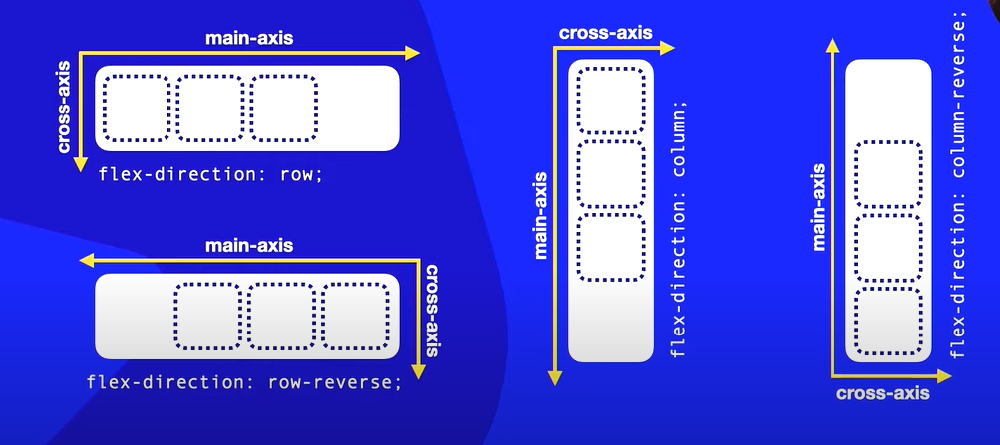

# flex-direction

Por padrão a flex direção é da **esquerda para a direita**
```
flex-direction: row;
------->
```
Mas você pode mudar a direção
```
flex-direction: row-reverse;
```
Existe também em direção vertical de cima pra baixo
```
flex-direction: column;
```
Mas você pode mudar a direção
```
flex-direction: column-reverse;
```
# Eixos (axis)
