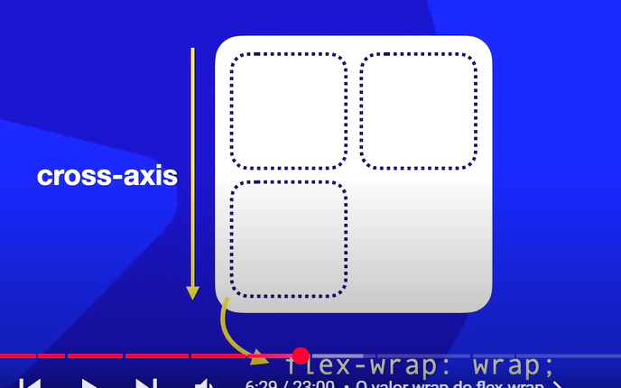

# flex-wrap

ELe causa a quebra dos itens dentro de uma unidade pai. No sentido do **cross-axis**
```
flex-wrap: wrap;
```


Você também pode mudar o sentido da quebra dos itens
```
flex-wrap: wrap-reverse;
```


<hr>


Ele sempre vai quebrar no sentido do **cross-axis**

mas se você colocar 
```
flex-wrap: wrap-reverse;
```
