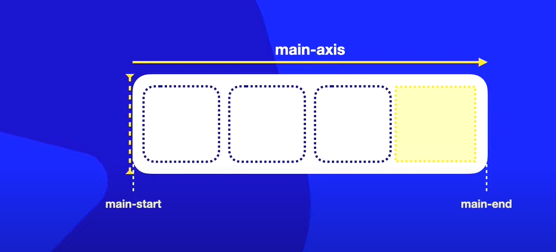

# justify-content
 
 Alinha os elementos de acordo com o main-axis

## justify-content:flex-start

O espaço em branco sempre ficara no main-end ou seja no final do eixo

## justify-content: flex-end

O espaço em branco vai ficar no main-start ou seja no inicio do eixo

## justify-content: center

Ficara centralizado

## justify-content: space-between

O primeiro elemnto que estiver dentro do elemento pai ficara no main-start e o terceiro elemento ficara no main-end. E os elementos que estiverem entre eles ficaram com um espaçamento por igual

## justify-content: space-evenly

Ele não vai grudar o primeiro e o ultimo elemento nas estremidades do elemento pai. Mas terão espaçamentos iguais.

## justify-content: space-around

Ele vai pegar o espaço completo do elemento pai e vai dividilos em partes iguais. E vai centralizar os intes dentre das partes iguais divididas

# align-items

Alinha os elementos de acordo com o cross-axis ou seja de cima pra baixo

## align-items: stretch

Valor padrão, ou seja ele estica os elementos

## align-items: flex-start

Ele vai deixar os itens grudados no cross-start e deixar o espaço em branco no cross-end

## align-items: flex-end

Vai acontecer o oposto

## align-items: center

Vai centralizar no centro do **cross-axis**