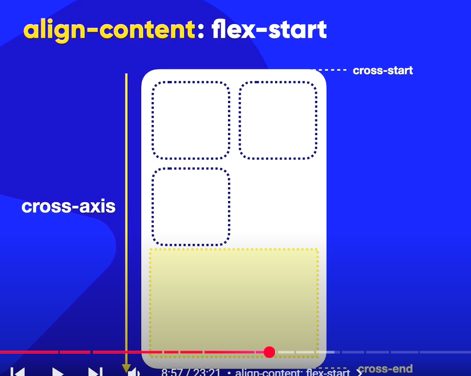

# align-content

Ela é usada para controlar o alinhamento vertical das linhas de itens flexíveis quando há espaço extra no contêiner.

Por padrão ele tem o valor 
```
align-content: stretch
```

# align-content: flex-start

Esse comando vai grudar os elementos no cross-start pra deixar um espaço em branco no cross-end



# align-content: flex-end

Ele faz o oposto

# align-content: center

Os itens ficarão alinhados no centro do elemento pai do cross-axis

# align-content: space-between


# align-content: space-evenly


# align-content: space-around

