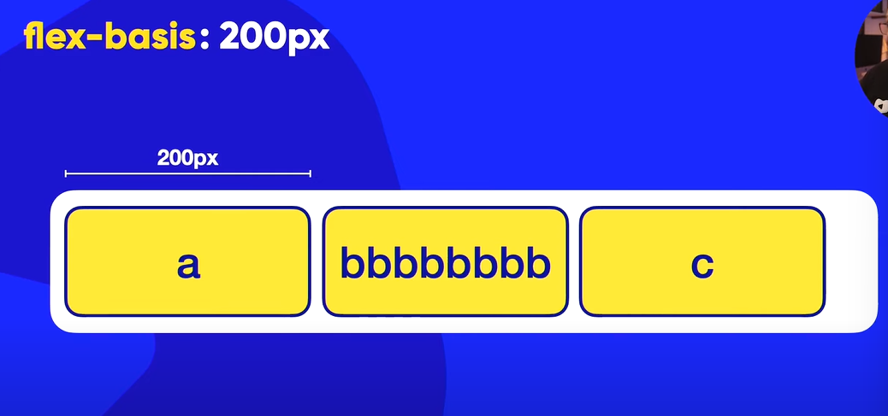

# flex-basic

o valor padrão será
```
flex-basic: auto;
```
E ele vai manter o tamanho dos elementos flexiveis de acordo com o conteudo dentro dos elementos filhos.

## flex-basic: 200px

Se você color um tipo de valor eles terão um tamanho fixo. Independente do tamanho do conteudo que esteja dentro dele



Mas se o conteiner diminuir os elementos filhos irão diminuir também, e os o conteudo que estiver dentro deles ira quebrar


E se você diminuir o conteiner demais


Acontece esse problema